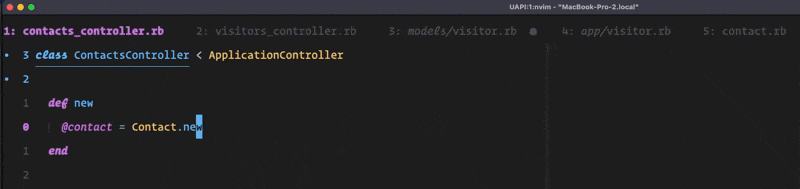
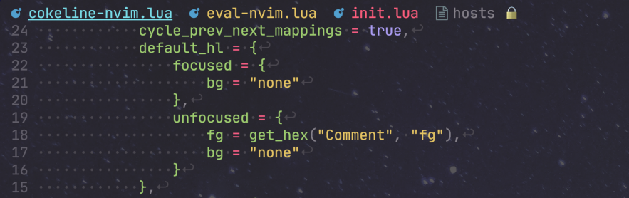

<h1 align="center">
  &#128067; cokeline.nvim
</h1>

<p align="center">
<i>A Neovim bufferline for people with addictive personalities</i>
</p>


## :book: Table of Contents

- [Features](#sparkles-features)
- [Requirements](#electric_plug-requirements)
- [Installation](#package-installation)
- [Configuration](#wrench-configuration)
- [Buffer](#buffer)
- [Components](#components)
- [Mappings](#musical_keyboard-mappings)
- [Showoff of user configs](#nail_care-showoff-of-user-configs)


## :sparkles: Features

<!-- TODO: -->

<!--   1. add buffer filters -->
<!--   2. rendering options -->

### Endlessly customizable

`cokeline.nvim` aims to be the most customizable bufferline plugin around. If
you have an idea in mind of what your bufferline should look like, you should
be able to make it look that way. If you can't, open an issue and we'll try to
make it happen!

Here's a quick showcase of what `cokeline.nvim` can be configured to look like.

#### `cokeline.nvim`'s default look

First, the default configuration:


  <details>
  <summary>Click to see configuration</summary>

  ```lua
  local get_hex = require('cokeline/utils').get_hex

  require('cokeline').setup({
    default_hl = {
      focused = {
        fg = get_hex('ColorColumn', 'bg'),
        bg = get_hex('Normal', 'fg'),
      },
      unfocused = {
        fg = get_hex('Normal', 'fg'),
        bg = get_hex('ColorColumn', 'bg'),
      },
    },

    components = {
      {
        text = function(buffer) return ' ' .. buffer.devicon.icon end,
        hl = {
          fg = function(buffer) return buffer.devicon.color end,
        },
      },
      {
        text = function(buffer) return buffer.unique_prefix end,
        hl = {
          fg = get_hex('Comment', 'fg'),
          style = 'italic',
        },
      },
      {
        text = function(buffer) return buffer.filename .. ' ' end,
      },
      {
        text = '',
        delete_buffer_on_left_click = true,
      },
      {
        text = ' ',
      }
    },
  })
  ```
  </details>

#### My configuration

Next, my personal configuration (which you can also find
[here](https://github.com/noib3/dotfiles/blob/master/configs/neovim/lua/plugins/config/cokeline.lua)
in my dotfiles):


  <details>
  <summary>Click to see configuration</summary>

  ```lua
  local get_hex = require('cokeline/utils').get_hex

  require('cokeline').setup({
    default_hl = {
      focused = {
        fg = get_hex('Normal', 'fg'),
        bg = get_hex('ColorColumn', 'bg'),
      },
      unfocused = {
        fg = get_hex('Comment', 'fg'),
        bg = get_hex('ColorColumn', 'bg'),
      },
    },

    components = {
      {
        text = '｜',
        hl = {
          fg = function(buffer)
            return
              buffer.is_modified
              and vim.g.terminal_color_3 -- yellow
               or vim.g.terminal_color_2 -- green
          end
        },
      },
      {
        text = function(buffer) return buffer.devicon.icon .. ' ' end,
        hl = {
          fg = function(buffer) return buffer.devicon.color end,
        },
      },
      {
        text = function(buffer) return buffer.index .. ': ' end,
      },
      {
        text = function(buffer) return buffer.unique_prefix end,
        hl = {
          fg = get_hex('Comment', 'fg'),
          style = 'italic',
        },
      },
      {
        text = function(buffer) return buffer.filename .. ' ' end,
        hl = {
          style = function(buffer) return buffer.is_focused and 'bold' or nil end,
        },
      },
      {
        text = ' ',
      },
    },
  })
  ```
  </details>

#### Comparison with `bufferline.nvim`

Finally, I wanted to test how versatile `cokeline.nvim` really was by trying to
replicate the default look of
[`bufferline.nvim`](https://github.com/akinsho/bufferline.nvim),
another bufferline plugin.

Here's the default `bufferline.nvim`:


and here's what I got by trying to replicate it


Notice in particular how differently the two plugins render bufferlines with
many files opened:  `bufferline.nvim` simply omits a buffer if it doesn't
fit entirely, while `cokeline.nvim` tries to squeeze in as much as possible and
cuts off the rest.

  <details>
  <summary>Click to see configuration</summary>

  ```lua
  local get_hex = require('cokeline/utils').get_hex

  require('cokeline').setup({
    default_hl = {
      focused = {
        fg = get_hex('Normal', 'fg'),
        bg = 'NONE',
      },
      unfocused = {
        fg = get_hex('Comment', 'fg'),
        bg = 'NONE',
      },
    },

    components = {
      {
        text = function(buffer) return (buffer.index ~= 1) and '▏' or '' end,
        hl = {
          fg = get_hex('Normal', 'fg')
        },
      },
      {
        text = function(buffer) return '    ' .. buffer.devicon.icon end,
        hl = {
          fg = function(buffer) return buffer.devicon.color end,
        },
      },
      {
        text = function(buffer) return buffer.filename .. '    ' end,
        hl = {
          style = function(buffer) return buffer.is_focused and 'bold' or nil end,
        }
      },
      {
        text = '',
        delete_buffer_on_left_click = true,
      },
      {
        text = '  ',
      },
    },
  })
  ```
  </details>

#### How?

The way `cokeline.nvim` achieves this is by modularizing everything into
distinct *components*. Go to [Functioning](#bulb-functioning) if you want to
learn more about how `cokeline.nvim` works internally.

### Dynamic rendering

Even when you have a lot of buffers open, `cokeline.nvim` is rendered to always
keep the focused buffer visible and in the middle of the bufferline:


### Clickable lines

You can switch focus between buffers with a left click and you can delete
them with a right click:


### Unique buffer names

When files with the same filename belonging to different directories are opened
simultaneously, you can configure your `cokeline` to include a unique filetree
prefix to distinguish between them:


### LSP Support

If a buffer has an LSP client attached to it, you can configure the style of a
component to change based on how many errors, warnings, infos and hints are
reported by the LSP.


  <details>
  <summary>Click to see configuration</summary>

  ```lua
  local get_hex = require('cokeline/utils').get_hex

  require('cokeline').setup({
    default_hl = {
      focused = {
        fg = get_hex('Normal', 'fg'),
        bg = get_hex('ColorColumn', 'bg'),
      },
      unfocused = {
        fg = get_hex('Comment', 'fg'),
        bg = get_hex('ColorColumn', 'bg'),
      },
    },

    components = {
      {
        text = function(buffer) return ' ' .. buffer.devicon.icon end,
        hl = {
          fg = function(buffer) return buffer.devicon.color end,
        },
      },
      {
        text = function(buffer) return buffer.filename end,
        hl = {
          fg = function(buffer)
            if buffer.diagnostics.errors ~= 0 then
              return vim.g.terminal_color_1 -- red
            end
            if buffer.diagnostics.warnings ~= 0 then
              return vim.g.terminal_color_3 -- yellow
            end
          end,

          style = function(buffer)
            local style
            if buffer.is_focused then
              style = 'bold'
            end
            if buffer.diagnostics.errors ~= 0 then
              if style then
                style = style .. ',underline'
              else
                style = 'underline'
              end
            end
            return style
          end,
        },
      },
      {
        text = ' ',
      },
      {
        text = '',
        delete_buffer_on_left_click = true,
      },
      {
        text = ' ',
      }
    },
  })
  ```
  </details>

### Close icons

Of course, you can add close icons to your `cokeline`:


### Line re-ordering

Don't like the order your buffers ended up in? Switch them around:


## :electric_plug: Requirements

`cokeline.nvim` requires:

- neovim 0.5+;
- a patched font (see [Nerd Fonts](https://www.nerdfonts.com/));
- `termguicolors` to be set.


## :package: Installation

### Lua

If you ported your Neovim config to Lua and use
[packer.nvim](https://github.com/wbthomason/packer.nvim) as your plugin
manager you can install this plugin with:
```lua
require('packer').startup(function()
  use {
    'noib3/cokeline.nvim',
    requires = 'kyazdani42/nvim-web-devicons', -- If you want devicons
  }
end)
```
After installing it, activate it with
``` lua
vim.opt.termguicolors = true
require('cokeline').setup({
  -- ...
})
```

### Vimscript

If your config is still written in Vimscript and you use
[vim-plug](https://github.com/junegunn/vim-plug) you can install this plugin
with:
```vim
call plug#begin('~/.config/nvim/plugged')
  Plug 'kyazdani42/nvim-web-devicons' " If you want devicons
  Plug 'noib3/cokeline.nvim'
call plug#end()
```
After installing it, activate it with
``` vim
set termguicolors
lua << EOF
require('cokeline').setup({
  -- ...
})
EOF
```


## :wrench: Configuration

You can configure your `cokeline` by changing the contents of the Lua table
passed to the `setup` function.

The valid keys are:
```lua
require('cokeline').setup({
  -- Show the bufferline when there are at least this many visible buffers.
  -- default: `1`.
  show_if_buffers_are_at_least = int,

  buffers = {
    -- A function to filter out unwanted buffers. Takes a buffer table as a
    -- parameter (see the `Buffer` section) and has to return either `true` or
    -- `false`.
    -- default: `false`.
    filter_valid = function(buffer) -> true | false,

    -- A looser version of `filter_valid`, use this function if you still
    -- want the `cokeline-{switch,focus}-{prev,next}` mappings to work for
    -- these buffers without displaying them in your bufferline.
    -- default: `false`.
    filter_visible = function(buffer) -> true | false,

    -- If set to `last` new buffers are added to the end of the bufferline,
    -- if `next` they are added next to the current buffer.
    -- default: 'last',
    new_buffers_position = 'last' | 'next',
  },

  mappings = {
    -- Controls what happens when the first (last) buffer is focused and you
    -- try to focus/switch the previous (next) buffer. If `true` the last
    -- (first) buffers gets focused/switched, if `false` nothing happens.
    -- default: `true`.
    cycle_prev_next = true | false,
  },

  rendering = {
    -- The maximum number of characters a rendered buffer is allowed to take
    -- up. The buffer will be truncated if its width is bigger than this
    -- value.
    -- default: `999`.
    max_buffer_width = int,
  },

  -- The default highlight group values for focused and unfocused buffers.
  -- The `fg` and `bg` keys are either colors in hexadecimal format or
  -- functions taking a `buffer` parameter and returning a color in
  -- hexadecimal format. Similarly, the `style` key is either a string
  -- containing a comma separated list of items in `:h attr-list` or a
  -- function returning one.
  default_hl = {
    focused = {
      -- default: `ColorColumn`'s background color.
      fg = '#rrggbb' | function(buffer) -> '#rrggbb',

      -- default: `Normal`'s foreground color.
      bg = '#rrggbb' | function(buffer) -> '#rrggbb',

      -- default: `'NONE'`.
      style = 'attr1,attr2,...' | function(buffer) -> 'attr1,attr2,...',
    },

    unfocused = {
      -- default: `Normal`'s foreground color.
      fg = '#rrggbb' | function(buffer) -> '#rrggbb',

      -- default: `ColorColumn`'s background color.
      bg = '#rrggbb' | function(buffer) -> '#rrggbb',

      -- default: `'NONE'`.
      style = 'attr1,attr2,...' | function(buffer) -> 'attr1,attr2,...',
    },
  },

  -- A list of components to be rendered for each buffer (see the `Components`
  -- section).
  -- default: see
  -- `https://github.com/noib3/cokeline.nvim/blob/master/lua/cokeline/defaults.lua`
  components = {},
})
```

## Buffer

Some of the configuration options can be set to functions that take a
`buffer` as a single parameter. This is useful as it allows users to set the
values of components dynamically based on the buffer that component is being
rendered for.

The `buffer` parameter is just a Lua table with the following keys:
```lua
buffer = {
  -- The buffer's order in the bufferline (`1` for the first buffer, `2` for
  -- the second buffer, etc.).
  index = int,

  -- The buffer's internal number as reported by `:ls`.
  number = int,

  is_focused = true | false,

  is_modified = true | false,

  is_readonly = true | false,

  -- The buffer's type as reported by `:echo &buftype`.
  type = 'string',

  -- The buffer's filetype as reported by `:echo &filetype`.
  filetype = 'string',

  -- The buffer's full path.
  path = 'string',

  -- The buffer's filename.
  filename = 'string',

  -- A unique prefix used to distinguish buffers with the same filename
  -- stored in different directories. For example, if we have two files
  -- `bar/foo.md` and `baz/foo.md`, then the first will have `bar/` as its
  -- unique prefix and the second one will have `baz/`.
  unique_prefix = 'string',

  -- This needs the `kyazdani42/nvim-web-devicons` plugin to be installed.
  devicon = {
    -- An icon representing the buffer's filetype.
    icon = 'string',

    -- The colors of the devicon in hexadecimal format (useful to be passed
    -- to a component's `hl.fg` field (see the `Components` section).
    color = '#rrggbb',
  },

  -- The values in this table are the ones reported by Neovim's built in
  -- LSP interface.
  diagnostics = {
    errors = int,
    warnings = int,
    infos = int,
    hints = int,
  },
}
```

## Components

You can configure what each buffer in your bufferline will be composed of by
passing a list of components to the `setup` function.

For example, let's imagine we want to construct a very minimal bufferline
where the only things we're displaying for each buffer are its index, its
filename and a close button.

Then in our `setup` function we'd have:
```lua
require('cokeline').setup({
  -- ...

  components = {
    {
      text = function(buffer) return ' ' .. buffer.index end,
    },
    {
      text = function(buffer) return ' ' .. buffer.filename .. ' ' end,
    },
    {
      text = '',
      delete_buffer_on_left_click = true,
    },
    {
      text = ' ',
    }
  }
}
```
in this case every buffer would be composed of four components: the first
displaying a space followed by the buffer index, the second one with the
filename padded by a space on each side, then a close button that allows us to
`:bdelete` the buffer when we left click on it, and finally an extra space.

This way of dividing each buffer into distinct components, combined with the
ability to define every component's text and color depending on some property
of the buffer we're rendering, allows for great customizability.

Every component passed to the `components` list has to be a table of the form:
```lua
{
  text = 'string' | function(buffer) -> 'string',

  -- The foreground, backgrond and style of the component. `style` is a
  -- comma-separated string of values defined in `:h attr-list`.
  hl = {
    fg = '#rrggbb' | function(buffer) -> '#rrggbb',
    bg = '#rrggbb' | function(buffer) -> '#rrggbb',
    style = 'attr1,attr2,...' | function(buffer) -> 'attr1,attr2,...',
  },

  -- If `true` the buffer will be deleted when this component is
  -- left-clicked (useful to implement close buttons).
  delete_buffer_on_left_click = true | false,

  truncation = {
    -- default: index of the component in the `components` table (1 for the
    -- first component, 2 for the second, etc.).
    priority = int,

    -- default: `right`.
    direction = 'left' | right',
  },
}
```
a component's `text` is the only key that has to be set, all the others are
optional and can be omitted.

The `truncation` table controls what happens when a buffer is too long to be
displayed in its entirety.

More specifically, if a buffer's width (given by the sum of the widths of all
its components) is bigger than the `rendering.max_buffer_width` config option,
the buffer will be truncated.

The default behaviour is truncate the buffer by dropping components from right
to left, with the text of the last component that's included also being
shortened from right to left. This can be modified by changing the values of
the `truncation.priority` and `truncation.direction` keys.

The `truncation.priority` controls the order in which components are dropped:
the first component to be dropped will be the one with the lowest priority. If
that's still not enough to bring the width of the buffer within the
`rendering.max_buffer_width` limit, the component with the second lowest
priority will be dropped, and so on. Note that a higher priority means a
smaller integer value: a component with a priority of `5` will be dropped
*after* a component with a priority of `6`, even though `6 > 5`.

The `truncation.direction` key simply controls from which direction a component
is shortened. For example, you might want to set the `truncation.direction` of
a component displaying a filename equal to `'left'`, so that if the filename
has to be shortened you'll still be able to see its extension.


## :musical_keyboard: Mappings

The following `<Plug>` mappings can be used as the right-hand side to user
defined mappings:

``` vim
" Focus the i-th buffer
nmap <silent> <Leader>1 <Plug>(cokeline-focus-1)
nmap <silent> <Leader>2 <Plug>(cokeline-focus-2)
" …and so on

" Switch the position of the current buffer with the i-th buffer
nmap <silent> <Space>1 <Plug>(cokeline-switch-1)
nmap <silent> <Space>2 <Plug>(cokeline-switch-2)
" …and so on

" Focus the previous/next buffer
nmap <silent> <S-Tab> <Plug>(cokeline-focus-prev)
nmap <silent> <Tab> <Plug>(cokeline-focus-next)

" Switch the position of the current buffer with the previous/next buffer
nmap <silent> <Leader>p <Plug>(cokeline-switch-prev)
nmap <silent> <Leader>n <Plug>(cokeline-switch-next)
```


## :nail_care: Showoff of user configs

Open a new issue or send a PR if you'd like to have your configuration featured
here!

### author: [@olimorris](https://github.com/olimorris/dotfiles)



<details>
<summary>Click to see configuration</summary>

```lua
local M = {}

function M.setup()
  local present, cokeline = pcall(require, "cokeline")
  if not present then
    return
  end

  local colors = require("colors").get()

  cokeline.setup({

    show_if_buffers_are_at_least = 2,
    cycle_prev_next_mappings = true,

    default_hl = {
      focused = {
        fg = colors.purple,
        bg = "NONE",
        style = "bold",
      },
      unfocused = {
        fg = colors.gray,
        bg = "NONE",
      },
    },

    components = {
      {
        text = function(buffer)
          return buffer.index ~= 1 and "  "
        end,
      },
      {
        text = function(buffer)
          return buffer.index .. ": "
        end,
        hl = {
          style = function(buffer)
            return buffer.is_focused and "bold" or nil
          end,
        },
      },
      {
        text = function(buffer)
          return buffer.unique_prefix
        end,
        hl = {
          fg = function(buffer)
            return buffer.is_focused and colors.purple or colors.gray
          end,
          style = "italic",
        },
      },
      {
        text = function(buffer)
          return buffer.filename .. " "
        end,
        hl = {
          style = function(buffer)
            return buffer.is_focused and "bold" or nil
          end,
        },
      },
      {
        text = function(buffer)
          return buffer.is_modified and " ●"
        end,
        hl = {
          fg = function(buffer)
            return buffer.is_focused and colors.red
          end,
        },
      },
      {
        text = "  ",
      },
    },
  })
end

return M

```
</details>


### author: [@alex-popov-tech](https://github.com/alex-popov-tech/.dotfiles)



<details>
<summary>Click to see configuration</summary>

```lua
return function()
    local get_hex = require("cokeline/utils").get_hex
    local space = {text = " "}
    require("cokeline").setup(
        {
            cycle_prev_next_mappings = true,
            default_hl = {
                focused = {
                    bg = "none"
                },
                unfocused = {
                    fg = get_hex("Comment", "fg"),
                    bg = "none"
                }
            },
            components = {
                space,
                {
                    text = function(buffer)
                        return buffer.devicon.icon
                    end,
                    hl = {
                        fg = function(buffer)
                            return buffer.devicon.color
                        end
                    }
                },
                {
                    text = function(buffer)
                        return buffer.filename
                    end,
                    hl = {
                        fg = function(buffer)
                            if buffer.is_focused then
                                return "#78dce8"
                            end
                            if buffer.is_modified then
                                return "#e5c463"
                            end
                            if buffer.lsp.errors ~= 0 then
                                return "#fc5d7c"
                            end
                        end,
                        style = function(buffer)
                            if buffer.is_focused then
                                return "underline"
                            end
                            return nil
                        end
                    }
                },
                {
                    text = function(buffer)
                        if buffer.is_readonly then
                            return " 🔒"
                        end
                        return ""
                    end
                },
                space
            }
        }
    )
end
```
</details>
