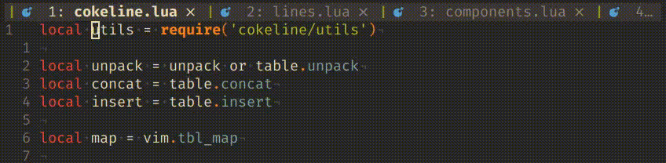
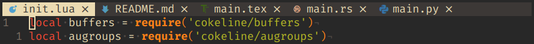
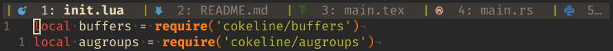
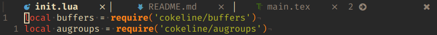
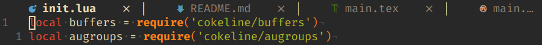
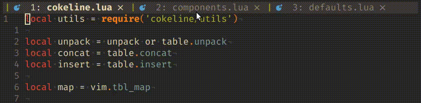
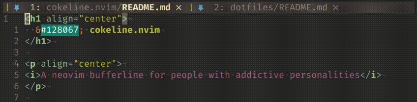
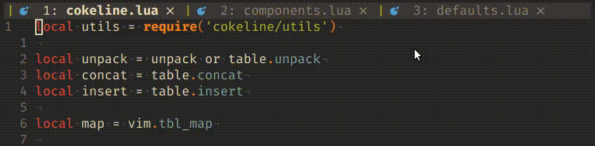

<h1 align="center">
  &#128067; cokeline.nvim
</h1>

<p align="center">
<i>A neovim bufferline for people with addictive personalities</i>
</p>



## :book: Table of Contents

- [Features](#sparkles-features)
- [Requirements](#electric_plug-requirements)
- [Installation](#package-installation)
- [Functioning](#bulb-functioning)
- [Configuration](#wrench-configuration)
- [Mappings](#musical_keyboard-mappings)
- [TODOs](#chart_with_upwards_trend-todos)
- [Credits](#pray-credits)

## :sparkles: Features

### Endlessly customizable

`cokeline.nvim` aims to be the most customizable bufferline plugin around. If
you have an idea in mind of what your bufferline should look like, you should
be able to make it look that way. If you can't, open an issue and we'll try to
make it happen!

Here's a quick showcase of what `cokeline.nvim` can be configured to look like.

#### `cokeline.nvim`'s default look

First, the default configuration:



  <details>
  <summary>Click to see configuration</summary>

  ```lua
  local get_hex = require('cokeline/utils').get_hex

  require('cokeline').setup({
    default_hl = {
      focused = {
        fg = get_hex('ColorColumn', 'bg'),
        bg = get_hex('Normal', 'fg'),
      },
      unfocused = {
        fg = get_hex('Normal', 'fg'),
        bg = get_hex('ColorColumn', 'bg'),
      },
    },

    components = {
      {
        text = function(buffer) return ' ' .. buffer.devicon.icon end,
        hl = {
          fg = function(buffer) return buffer.devicon.color end,
        },
      },
      {
        text = function(buffer) return buffer.unique_prefix end,
        hl = {
          fg = get_hex('Comment', 'fg'),
          style = 'italic',
        },
      },
      {
        text = function(buffer) return buffer.filename .. ' ' end,
      },
      {
        text = '',
        delete_buffer_on_left_click = true,
      },
      {
        text = ' ',
      }
    },
  })
  ```
  </details>

#### My configuration

Next, my personal configuration (which you can also find
[here](https://github.com/noib3/dotfiles/blob/master/configs/neovim/lua/plugins/config/cokeline.lua)
in my dotfiles):



  <details>
  <summary>Click to see configuration</summary>

  ```lua
  local get_hex = require('cokeline/utils').get_hex

  require('cokeline').setup({
    default_hl = {
      focused = {
        fg = get_hex('Normal', 'fg'),
        bg = get_hex('ColorColumn', 'bg'),
      },
      unfocused = {
        fg = get_hex('Comment', 'fg'),
        bg = get_hex('ColorColumn', 'bg'),
      },
    },

    components = {
      {
        text = '｜',
        hl = {
          fg = function(buffer)
            return
              buffer.is_modified
              and vim.g.terminal_color_3 -- yellow
               or vim.g.terminal_color_2 -- green
          end
        },
      },
      {
        text = function(buffer) return buffer.devicon.icon .. ' ' end,
        hl = {
          fg = function(buffer) return buffer.devicon.color end,
        },
      },
      {
        text = function(buffer) return buffer.index .. ': ' end,
      },
      {
        text = function(buffer) return buffer.unique_prefix end,
        hl = {
          fg = get_hex('Comment', 'fg'),
          style = 'italic',
        },
      },
      {
        text = function(buffer) return buffer.filename .. ' ' end,
        hl = {
          style = function(buffer) return buffer.is_focused and 'bold' or nil end,
        },
      },
      {
        text = ' ',
      },
    },
  })
  ```
  </details>

#### Comparison with `bufferline.nvim`

Finally, I wanted to test how versatile `cokeline.nvim` really was by trying to
replicate the default look of
[`bufferline.nvim`](https://github.com/akinsho/bufferline.nvim),
another bufferline plugin.

Here's the default `bufferline.nvim`:



and here's what I got by trying to replicate it



Notice in particular how differently the two plugins render bufferlines with
many files opened:  `bufferline.nvim` simply omits a buffer if it doesn't
fit entirely, while `cokeline.nvim` tries to squeeze in as much as possible and
cuts off the rest.

  <details>
  <summary>Click to see configuration</summary>

  ```lua
  local get_hex = require('cokeline/utils').get_hex

  require('cokeline').setup({
    default_hl = {
      focused = {
        fg = get_hex('Normal', 'fg'),
        bg = 'NONE',
      },
      unfocused = {
        fg = get_hex('Comment', 'fg'),
        bg = 'NONE',
      },
    },

    components = {
      {
        text = function(buffer) return (buffer.index ~= 1) and '▏' or '' end,
        hl = {
          fg = get_hex('Normal', 'fg')
        },
      },
      {
        text = function(buffer) return '    ' .. buffer.devicon.icon end,
        hl = {
          fg = function(buffer) return buffer.devicon.color end,
        },
      },
      {
        text = function(buffer) return buffer.filename .. '    ' end,
        hl = {
          style = function(buffer) return buffer.is_focused and 'bold' or nil end,
        }
      },
      {
        text = '',
        delete_buffer_on_left_click = true,
      },
      {
        text = '  ',
      },
    },
  })
  ```
  </details>

#### How?

The way `cokeline.nvim` achieves this is by modularizing everything into
distinct *components*. Go to [Functioning](#bulb-functioning) if you want to
learn more about how `cokeline.nvim` works internally.

### Dynamic rendering

Even when you have a lot of buffers open, `cokeline.nvim` is rendered to always
keep the focused buffer visible and in the middle of the bufferline:


### Clickable lines

You can switch focus between buffers with a left click and you can delete
them with a right click:



### Unique buffer names

When files with the same filename belonging to different directories are opened
simultaneously, you can configure your `cokeline` to include a unique filetree
prefix to distinguish between them:



### LSP Support

If a buffer has an LSP client attached to it, you can configure the style of a
component to change based on how many errors, warnings, infos and hints are
reported by the LSP.


  <details>
  <summary>Click to see configuration</summary>

  ```lua
  local get_hex = require('cokeline/utils').get_hex

  require('cokeline').setup({
    default_hl = {
      focused = {
        fg = get_hex('Normal', 'fg'),
        bg = get_hex('ColorColumn', 'bg'),
      },
      unfocused = {
        fg = get_hex('Comment', 'fg'),
        bg = get_hex('ColorColumn', 'bg'),
      },
    },

    components = {
      {
        text = function(buffer) return ' ' .. buffer.devicon.icon end,
        hl = {
          fg = function(buffer) return buffer.devicon.color end,
        },
      },
      {
        text = function(buffer) return buffer.filename end,
        hl = {
          fg = function(buffer)
            if buffer.lsp.errors ~= 0 then
              return vim.g.terminal_color_1 -- red
            end
            if buffer.lsp.warnings ~= 0 then
              return vim.g.terminal_color_3 -- yellow
            end
          end,

          style = function(buffer)
            local style
            if buffer.is_focused then
              style = 'bold'
            end
            if buffer.lsp.errors ~= 0 then
              if style then
                style = style .. ',underline'
              else
                style = 'underline'
              end
            end
            return style
          end,
        },
      },
      {
        text = ' ',
      },
      {
        text = '',
        delete_buffer_on_left_click = true,
      },
      {
        text = ' ',
      }
    },
  })
  ```
  </details>

### Close icons

Of course, you can add close icons to your `cokeline`:



### Line re-ordering

Don't like the order your buffers ended up in? Switch them around:


## :electric_plug: Requirements

`cokeline.nvim` requires:

- neovim 0.5+;
- a patched font (see [Nerd Fonts](https://www.nerdfonts.com/));
- `termguicolors` to be set.

## :package: Installation

### Lua

If you ported your neovim config to Lua and use
[packer.nvim](https://github.com/wbthomason/packer.nvim) as your plugin
manager you can install this plugin with:
```lua
require('packer').startup(function()
  use {
    'noib3/cokeline.nvim',
    requires = 'kyazdani42/nvim-web-devicons', -- If you want devicons
  }
end)
```
After installing it, activate it with
``` lua
vim.opt.termguicolors = true
require('cokeline').setup({
  -- ...
})
```

### Vimscript

If your config is still written in Vimscript and you use
[vim-plug](https://github.com/junegunn/vim-plug) you can install this plugin
with:
```vim
call plug#begin('~/.config/nvim/plugged')
  Plug 'kyazdani42/nvim-web-devicons' " If you want devicons
  Plug 'noib3/cokeline.nvim'
call plug#end()
```
After installing it, activate it with
``` vim
set termguicolors
lua << EOF
require('cokeline').setup({
  -- ...
})
EOF
```

## :bulb: Functioning

Internally, `cokeline.nvim` defines two objects: *lines* and *components*.

The bufferline that is rendered and displayed to the user is a collection of
lines, and every line is itself a collection of components.

A line is linked to one (and only one) listed buffer. For example, if we open
two files -- lets call them `foo.md` and `bar.md` -- then `:ls` will list two
buffers, and cokeline will display two lines, one for `foo.md` and another for
`bar.md`.

The components that every line is made up of are configured in the
`require('cokeline').setup` function by passing a list of components to the
`components` key.

Each component has to be a table of the form:
```lua
  {
    text = function(buffer) | '{string}',
    hl = {
      fg = function(buffer) | '#rrbbgg',
      bg = function(buffer) | '#rrbbgg',
      style = function(buffer) | '{style}',
    },
    delete_buffer_on_left_click = true | false,
  },
```
A component's `text` can be either be a function or a string. If it's a
function, it has to take the `buffer` linked to the line that component belongs
to as a parameter.

That `buffer` parameter is itself a key-value table with the following keys:
```lua
  buffer = {
    -- The buffer's internal number as reported by `:ls`.
    -- type: int
    number = ..,

    -- The buffer's index in the bufferline (1 for the first buffer, 2 for the
    -- second one, etc.).
    -- type: int
    index = ..,

    -- Set to true if the buffer is focused.
    -- type: bool
    is_focused = true | false,

    -- Set to true if the buffer has been modified.
    -- type: bool
    is_modified = true | false,

    -- Set to true if the buffer is 'readonly'.
    -- type: bool
    is_readonly = true | false,

    -- The buffer's type as reported by 'buftype'.
    -- type: string
    type = '..',

    -- The buffer's full path.
    -- type: string
    path = '..',

    -- The buffer's filename.
    -- type: string
    filename = '..',

    -- A unique filetree prefix used to distinguish buffers with the same
    -- filename. For example, if we edit two files each named `foo.md`, one
    -- inside the `bar` directory and the other inside the `baz` directory,
    -- then one will have `bar/` as its unique prefix and the other one will
    -- have `baz/`.
    -- type: string
    unique_prefix = '..',

    -- Needs `kyazdani42/nvim-web-devicons`
    devicon = {
      -- An icon representing the buffer's filetype.
      -- type: string
      icon = '..',

      -- The color of the devicon in hexadecimal format
      -- type: string
      color = '..',
    },

    -- If the buffer has an LSP client attached to it (you can check that with
    -- ':LspInfo'), this table lists the number of errors, warnings, infos and
    -- hints reported by the LSP.
    lsp = {
      -- type: int
      errors = ..,

      -- type: int
      warnings = ..,

      -- type: int
      infos = ..,

      -- type: int
      hints = ..,
    }
  }
```

`hl` is a table defining the foreground color, background color and style of
that component (if different from the default ones, see
[Configuration](#wrench-configuration)). Like `text`, they too can either be
functions or strings, however:

  - `hl.fg` and `hl.bg` have to be strings representing a 24-bit color in
    hexadecimal format, or functions returning a color in hexadecimal format.
  - `hl.style` has to be a style among the ones listed in `:h attr-list` or a
    function returning one.

`delete_buffer_on_left_click` expects a boolean value. If true, the buffer is
deleted when the user left clicks that component. This is usually used to
implement close buttons.

## :wrench: Configuration

`cokeline.nvim` is configured by passing a key-value table to the
`require('cokeline').setup` function. The default configuration is:

```lua
local get_hex = require('cokeline/utils').get_hex

require('cokeline').setup({
  -- If true the bufferline is hidden when only one buffer is listed
  hide_when_one_buffer = false,

  -- Controls what happens when the first (last) buffer is focused and the user
  -- tries to focus/switch to the previous (next) buffer. If true the last
  -- (first) buffer gets focused/switched to, if false nothing happens.
  cycle_prev_next_mappings = false,

  -- Default colors for the foregound/background of focused/unfocused
  -- lines. Their default values are derived from the foreground/background of
  -- other highlight groups.
  default_hl = {
    focused = {
      fg = get_hex('ColorColumn', 'bg'),
      bg = get_hex('Normal', 'fg'),
    },
    unfocused = {
      fg = get_hex('Normal', 'fg'),
      bg = get_hex('ColorColumn', 'bg'),
    },
  },

  -- A list of components used to build every line of the cokeline.
  components = {
    {
      text = function(buffer) return ' ' .. buffer.devicon.icon end,
      hl = {
        fg = function(buffer) return buffer.devicon.color end,
      },
    },
    {
      text = function(buffer) return buffer.unique_prefix end,
      hl = {
        fg = get_hex('Comment', 'fg'),
        style = 'italic',
      },
    },
    {
      text = function(buffer) return buffer.filename .. ' ' end,
    },
    {
      text = '',
      delete_buffer_on_left_click = true,
    },
    {
      text = ' ',
    }
  },
})
```

More configuration options are likely to be added as the plugin matures and I
get feedback from other users.


## :musical_keyboard: Mappings

The following `<Plug>` mappings are exposed to be able to focus buffers and to
switch their position. An example configuration could be:

``` vim
" Focus the i-th buffer
nmap <silent> <Leader>1 <Plug>(cokeline-focus-1)
nmap <silent> <Leader>2 <Plug>(cokeline-focus-2)
" …and so on

" Switch the position of the current buffer with the i-th buffer
nmap <silent> <Space>1 <Plug>(cokeline-switch-1)
nmap <silent> <Space>2 <Plug>(cokeline-switch-2)
" …and so on

" Focus the previous/next buffer
nmap <silent> <S-Tab> <Plug>(cokeline-focus-prev)
nmap <silent> <Tab> <Plug>(cokeline-focus-next)

" Switch the position of the current buffer with the previous/next buffer
nmap <silent> <Leader>p <Plug>(cokeline-switch-prev)
nmap <silent> <Leader>n <Plug>(cokeline-switch-next)
```

## :chart_with_upwards_trend: TODOs

Some of the features yet to be implemented are:

  - support for tabs;

  - support for sidebar offsets to provide a nice integration with
  NERDTree-like file explorer plugins;

  - equal sized buffer titles: if there are *n* buffers opened, every buffer
  title should take up *1/n*-th of the available space. This might be tricky to
  implement due to neovim being a terminal program and not a GUI one (i.e.,
  having to deal with discretely sized columns instead of pixels);

## :pray: Credits

This being my first ever neovim plugin, I looked at how `bufferline.nvim`
solved a couple of issues that I stumbled into along the way.

With that being said, `bufferline.nvim` is a much bigger project with a
codebase almost 5x bigger than the one of `cokeline.nvim`, and while there are
some features yet to be added (see
[TODOs](#chart_with_upwards_trend-todostodos)), the plan is to always keep this
plugin fairly small and minimal compared to other similar projects.
